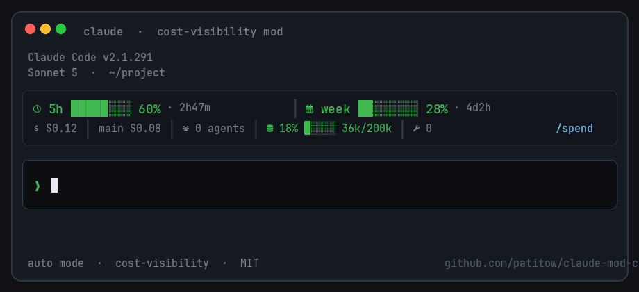

# claude-mod-cost-visibility

**A [Claude Code](https://code.claude.com) mod** — live session cost, context window, and plan-quota meters *above the prompt*. Built for the new mods / function-hooks API (2.1.287+).




## Requirements

| | |
| --- | --- |
| **Claude Code** | ≥ **2.1.287** (mods / function hooks) |
| **Nerd Font** | **Required for icons** in the band. Without one you get □ / tofu boxes; meters and numbers still work. |

Pick any [Nerd Font](https://www.nerdfonts.com/font-downloads) (JetBrains Mono, FiraCode, Hack, …), install it, then set it as your **terminal font**.

```bash
# check
./scripts/check-nerd-font.sh

# macOS example
brew install --cask font-jetbrains-mono-nerd-font
```

Then: terminal settings → Font → choose a face with **“Nerd Font”** in the name.

## Install

Helper (checks Nerd Font + prints commands):

```bash
git clone https://github.com/patitow/claude-mod-cost-visibility.git
cd claude-mod-cost-visibility
./install.sh
```

### Marketplace (recommended)

```bash
claude plugin marketplace add patitow/claude-mod-cost-visibility
claude plugin install cost-visibility@claude-mod-cost-visibility
```

Restart Claude Code, then look above the prompt. Type `/spend` for the pane.

### One-shot / local

```bash
git clone https://github.com/patitow/claude-mod-cost-visibility.git
claude --plugin-dir ./claude-mod-cost-visibility/plugins/cost-visibility
```

Or always-on via settings `env`:

```json
{
  "env": {
    "CLAUDE_CODE_PLUGIN_DIRS": "/absolute/path/to/claude-mod-cost-visibility/plugins/cost-visibility"
  }
}
```

### Validate

```bash
claude plugin validate ./plugins/cost-visibility
```

## What you get

Two-line band above the prompt (colors + Nerd Font icons + meter bars):

```
 5h ██████░░ 103% · 2h47m  │   week ██░░░░░░ 32% · 4d2h
 $1.24  │  ● main $0.83  │   $0.41 ×2  │   42% ██░░░ 84k/200k  │   12    /spend
```

- **Plan windows** — 5h / 7d (and gateway spend cap) with countdown
- **This-chat burn** — list-price `$` (`cost.usd`), split main vs subagents
- **Context meter** — % + tokens / window
- **`/spend`** — side pane with the full breakdown (Refresh / Close)

> Dollars are **API list-price estimates** (same yardstick as Claude’s cost ledger). On a Team/subscription plan they are a burn meter, not your invoice. Org monthly spend still lives in claude.ai → Usage (Owners).

## How it works

- `$.session.usage()` → `cost.usd`, `context`, `rateLimits`
- `ui.render` → `AbovePrompt` band + `Spinner` suffix + `Pane`
- `turn.complete` → attributes cost deltas to main vs `agentId`

No network calls. Nothing is sent to the model from this mod.

## License

MIT — see [LICENSE](./LICENSE).
